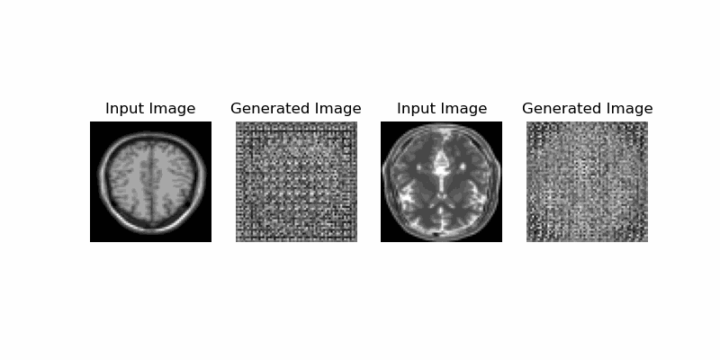

# 🧠 Style Transfer Using GAN

This project implements a Generative Adversarial Network (GAN) to perform **style transfer** between two domains of grayscale images — referred to as **T1** and **T2** (commonly used in MRI imaging contexts). The GAN learns to translate images from one domain to the other while preserving key structural features.

## 📁 Project Structure

- `Style Transfer GAN.ipynb`: Main notebook containing code for:
  - Data loading and preprocessing
  - Visualization of T1 and T2 datasets
  - Generator and Discriminator architecture
  - GAN training and loss tracking
  - Image generation and evaluation

- `data/TrainT1` and `data/TrainT2`: Directories containing source domain images.

## 🚀 How It Works

### 1. Data Preparation
- Loads grayscale medical images from local folders.
- Normalizes pixel values to `[-1, 1]`.
- Visualizes a few samples from both domains.

### 2. Model Architecture
- Implements a **CycleGAN-like** architecture with:
  - Two generators (T1 → T2 and T2 → T1)
  - Two discriminators (one for each domain)
- Uses skip connections and convolutional layers.

### 3. Loss Functions
- Adversarial loss to encourage realism.
- Cycle-consistency loss to maintain content.
- Identity loss for style preservation.

### 4. Training
- Trains with alternating optimization of generators and discriminators.
- Visual checkpoints for progress monitoring.

### 5. Inference
- Transfers style from T1 → T2 and vice versa.
- Generates side-by-side comparisons.

## 🧰 Technologies Used

- Python 3.11
- TensorFlow / Keras
- NumPy, Matplotlib
- imageio, skimage

## 📸 Sample Results

*(Add output visuals of T1 → T2 and T2 → T1 after training)*

## 🎥 Style Transfer Demo



## 📦 Requirements

Install dependencies using:
```bash
pip install -r requirements.txt


